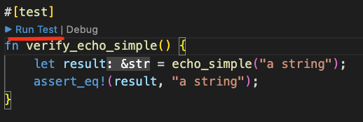

# Advent of code setup
Rust template with layout prepared for Advent of code 2022. Created to be used to learn Rust.

## Environment
1. First install `rustup` and `cargo` from this [page](https://www.rust-lang.org/learn/get-started).

2. Consider VS Code and [rust-analyzer](https://marketplace.visualstudio.com/items?itemName=rust-lang.rust-analyzer) plugin as development environment.

## Run tests with cargo
- Run all the tests with cargo `cargo test`
- Run specific test with cargo `cargo test verify_error_handling_not_ok`, to run this test anywhere in your code.
- Run specific test with VS Code.

## How to use
December first is prepared with:
- `src/dec01/solution.rs`
- `src/dec01.rs`
- `test/dec01tests.rs`
- Added row for dec01 module in `src/lib.rs`

For December 2 and forward just create the tree equivalent files above and add module in `src/lib.rs`.

## Todo

- [x] Test code/days individually with `cargo test`
- [x] Read and parse files example
- [x] Modularize so that previous solutions can be reused without making a mess
- [ ] Demo concurrency with async await abstraction
- [ ] Demo errorhandling with Result